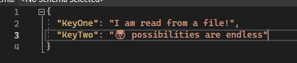
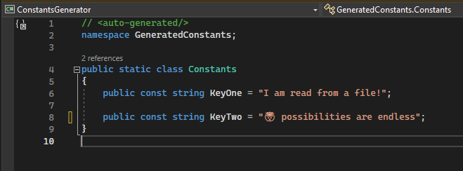

# ConstantsGenerator
A proof of concept for source generating constants classes

My wish was to take a json file & generate a static class using the key value pairs. 

Becomes

This can now be used by our console application 🥳
